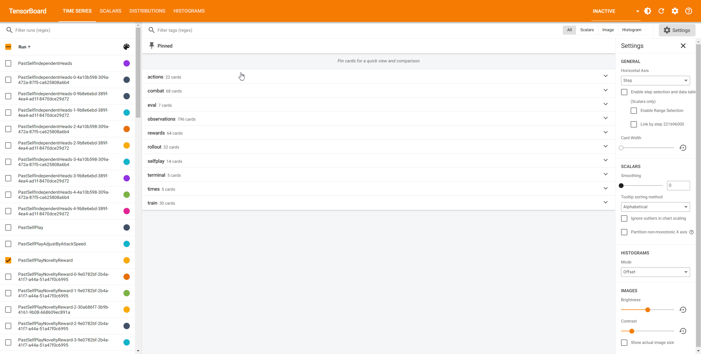

# PvP ML

This contains the core reinforcement learning logic that drives the entire project. It includes scripts for
orchestrating the training process, evaluating the environment, and serving models through a socket-based API.

#### Example Training Run:

## How To Use

This requires having conda (or some variant of it) installed, so that the `conda` command is available.

1. Create the environment: `conda env create -p ./env -f environment.yml`.
2. Activate the environment: `conda activate ./env`.

For CPU-only training, uncomment `cpuonly` in the conda environment file before creating the environment. By default,
training uses GPU if available.

### Evaluate Model (on simulation)

This will run an agent on a simulated server to fight against.

1. Run the evaluation script with a model: `eval --model-path <model-path-here>`.
2. [Log in to the simulated server](../simulation-rsps/README.md#connect-to-server-via-client) and play against the
   agent!

### Serve Models via API

This serves models in [models](models) via a socket-based API for fast predictions.

1. Start the API: `serve-api`.
2. Connect using a client (example: [PvpClient](test/integ/api_client.py)).

By default, it only accepts connections on `127.0.0.1`, configurable with `--host`.

### Start Training Job

1. Configure the job in [./config](config) - or use an existing config such as `PastSelfPlay`.
2. Start the job: `train --preset PastSelfPlay --name <name-your-experiment>`.
3. Stop the job: `train cleanup --name <your-experiment-name>` or `train cleanup --name all` to terminate all jobs.

**Note:** Training logs are stored in `./logs` and experiment data, including model versions, are stored in
`./experiments`.

### Tensorboard

* Tensorboard automatically launches with training jobs, or run `train tensorboard` to start it manually. Access it
  at http://127.0.0.1:6006/.
* Tensorboard logs are stored in `./tensorboard` under the experiment name.

#### Tensorboard Metrics Visualization:

## Features

* Generalized PvP environment setup.
* Model evaluation support.
* Model serving through a socket-based API.
* Distributed rollout collection.
* Parameterized and masked actions, including autoregressive actions (with normalization).
* TorchScript-compatible models for efficient evaluation.
* Self-play strategies, including prioritized past-self play (based on OpenAI Five paper).
* Adversarial training (based on DeepMind's SC2 paper).
* Reward normalization and observation normalization.
* Novelty rewards.
* Distributed model processing via various `RemoteProcessor` implementations.
* Noise generation.
* Flexible parameter annealing through comprehensive scheduling.
* Asynchronous training job management.
* Comprehensive metric recording (Tensoboard).
* Scripted plugins for evaluation and API.
* PPO implementation.
* Async vectorized environment.
* Customizable model architectures.
* Gradient accumulation.
* Detailed configuration via YAML.
* PvP Environment implementation with configurable rewards.
* Full game state visibility for the critic.
* Frame stacking.
* Comprehensive callback system.
* Environment randomization for generalization.
* Elo-based ranking and rating generation for benchmarking.
* Supplementary model for episode outcome prediction.

### Distributed Training

* Supports Ray for distributed rollouts on a cluster or multiple CPU cores.
* Train with distribution: `train --preset <preset> --distribute <parallel-rollout-count>`.
* Omit `<parallel-rollout-count>` to use all available CPU cores.

#### Cluster Management (via AWS)

* Scale up a cluster: `ray up cluster.yml`.
* Scale down a cluster: `ray down cluster.yml`.
* View the cluster: `ray attach cluster.yml --port-forward=8265` to open dashboard.

### NH Environment

* Focuses on 1v1 NH fights.
* MultiDiscrete action space with 11 action heads.
* Extensive observation space.

**See [the environment contract](../contracts/environments/NhEnv.json) for details.**

### Pre-Trained Models

* Available in [models](models).
* Trained for PvP Arena/LMS for various builds and gear setups.
* Includes `GeneralizedNh` (self-play) and `FineTunedNh` (`GeneralizedNh` fine-tuned against human approximations).

## Possible Enhancements

### Better Human Prediction

* Investigate bootstrapping from human replays for improved human-like behavior.
* Consider blending behavior cloning with self-play.

### Memory

* Experiment with LSTM or transformer architectures for episode recall and strategy adaptation.

**Note:** Some experimentation was done with transformers (with frame-stacking), but simple FF networks
learned quicker and outperformed the more complex networks.

### Fine-Tune Agents On Live Game

* Explore rollouts on the live game for enhanced realism and human player adaptation.

# Helpful Resources

These are some resources that helped the most when working on this project.

* [Stable Baselines 3](https://github.com/DLR-RM/stable-baselines3)
* [CleanRL](https://github.com/vwxyzjn/cleanrl)
* [Dota 2 with Large Scale Deep Reinforcement Learning](https://arxiv.org/abs/1912.06680)
* [Grandmaster level in StarCraft II using multi-agent reinforcement learning](https://www.nature.com/articles/s41586-019-1724-z)
* [r/reinforcementlearning](https://www.reddit.com/r/reinforcementlearning/)
